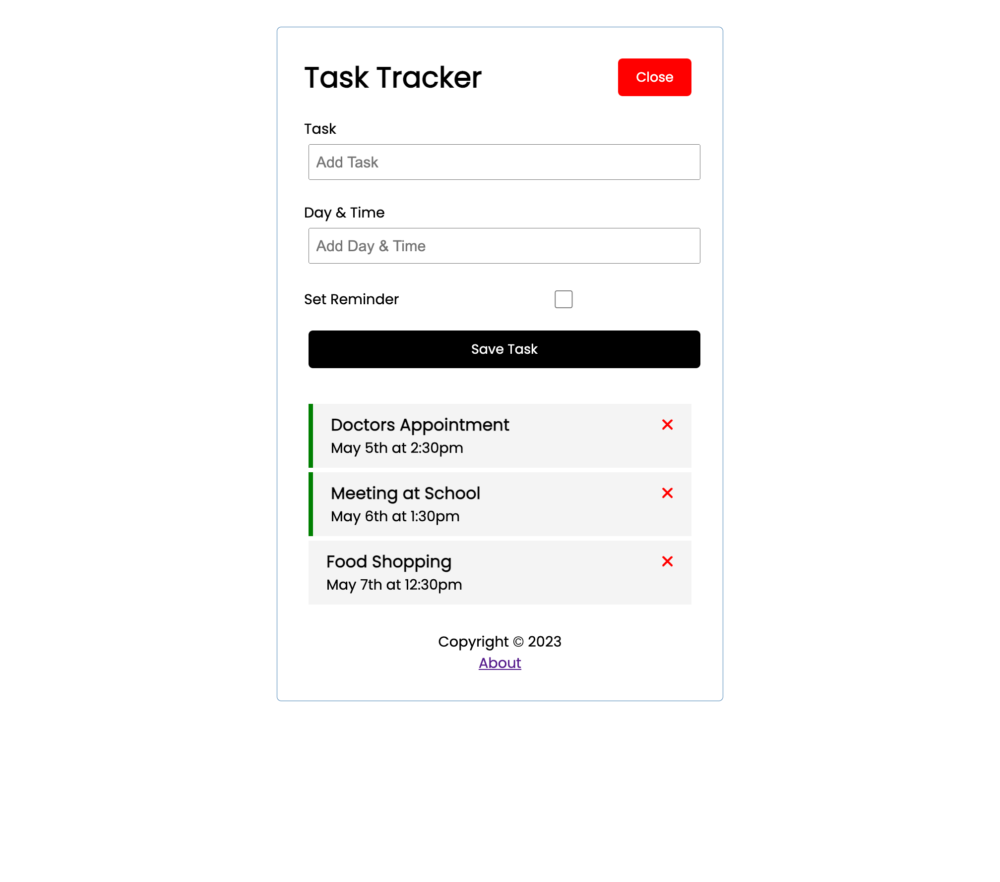

# AngularTaskTracker

Sample project for a task tracker app built with Angular 15 and JSON-server for the mock backend.



## Build Setup

```bash
# install dependencies
$ npm install

# json-server start
$ npm run server

# serve with hot reload at localhost:4200
$ ng start

# build for production
$ ng build

# running unit tests
$ ng test
```

## Further help

To get more help on the Angular CLI use `ng help` or go check out the [Angular CLI Overview and Command Reference](https://angular.io/cli) page.
